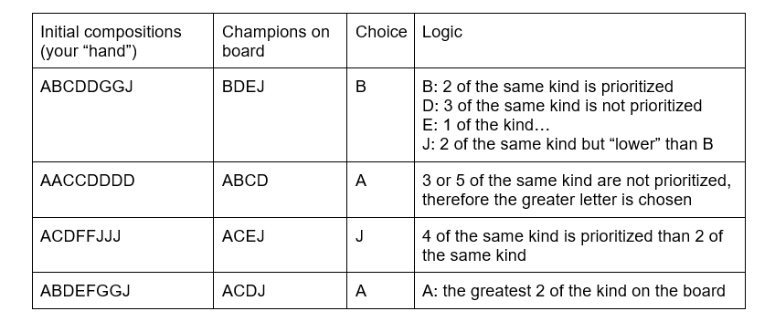

# CISC/CMPE 204 Modelling Project

This project models a simplified version of the Teamfight Tactics (TFT) strategy game using various propositions and constraints.

#### Simplifications:
You will win against your opponent(s) based on this checklist:
-	6 of a kind
-	4 of a kind
-	2 of a kind
-	Single

If there is a tie, you will win if you have the highest 6/4/2/1 of a kind.

Champions are denoted with letters. The champion of the highest value is A, the champion of the second highest value is B, ..., the champion with the lowest value is J.

The goal of the model is to seek the best possible champion of choice on the board to "acquire" based off of:
- (1) the champions currently present on the board available for acquisition, and
- (2) the champions currently present in your "hand".

**Examples:**

For more information, you can read the project report at [Modelling_report](documents/final/modelling_report.docx).

## Structure

* `documents`: Contains folders for both of your draft and final submissions. README.md files are included in both.
* `run.py`: General wrapper script that you can choose to use or not. Only requirement is that you implement the one function inside of there for the auto-checks.
* `test.py`: Run this file to confirm that your submission has everything required. This essentially just means it will check for the right files and sufficient theory size.
